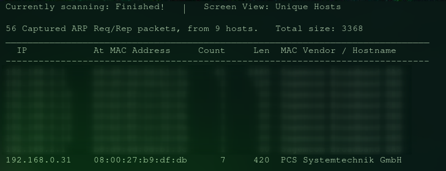
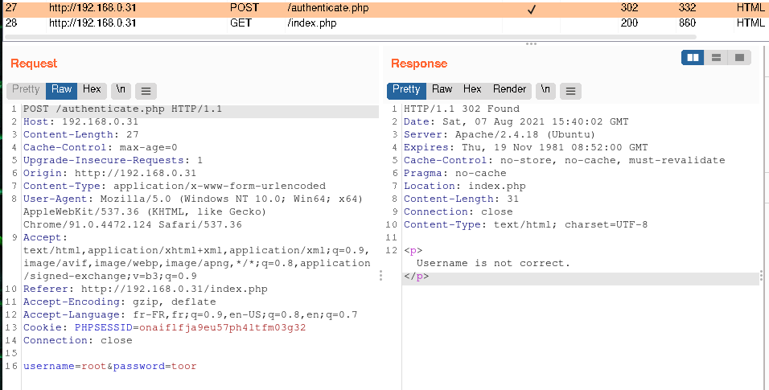

## Discovery
Let's read the infos.
[https://www.vulnhub.com/entry/ted-1,327/](https://www.vulnhub.com/entry/ted-1,327/)

How well do you understand `PHP programs`? 
How familiar are you with `Linux misconfigurations`? 
This image will cover `advanced Web attacks`, out of the box thinking and the latest security vulnerabilities.

Please note that this is capture the flag machine which means it is not real life scenario 
but will challenge you hard before you can obtain root privileges.
## Scanning
### netdiscover
sudo netdiscover 192.168.0.0/16

### nmap
sudo nmap -sV -p- 192.168.0.31

Only the port 80 is open.

This is what we have:

I found nothing with dirbuster and nikto.
let's try with Burpsuit.
### burpsuit
I intercept the traffic and open the Browser.
Request:

He talked about missconfiguration, let's try some creds like admin, user, root, toor, etc...

Here we go!
I think I found the password, now I need the username.

I saw 2 differents response:
1) Password or password hash is not correct, make sure to hash it before submit.
2) Username is not correct.
User=`toor`

